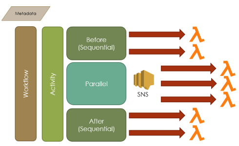
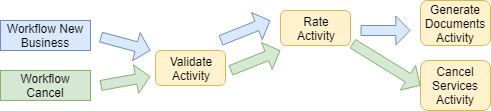
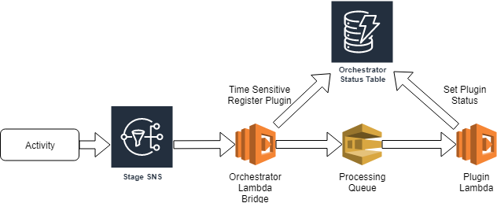

# Orchestrator

[](http://www.serverless.com)

package | version
--- | ---
@moe-tech/orchestrator | 2.0.0

<br/><br/>

# Table of Contents
- [Deploying the Orchestrator](#Deploying-the-Orchestrator)
    - [Parameter Store Keys](#Parameter-Store-Keys)
    - [Parameters](#Parameters)
    - [Deploying with AWS SAM](#Deploying-with-AWS-SAM)
    - [Deploying with Stackery](#Deploying-with-Stackery)
- [Overview of Orchestrator Terminology](#Overview-of-Orchestrator-Terminology)
- [Integrations](#Integrations)
- [Example Implementation](./examples/simple-step-workflow)

<br/>

# Deploying the Orchestrator

## Dependencies

AWS SAM

https://docs.aws.amazon.com/serverless-application-model/latest/developerguide/serverless-sam-cli-install.html

There are two steps to deploying the orchestrator.  The first step is to setup your parameter store configurations.  These are used by the deployment to dynamically adjust the orchestrator to include things such as Lambda Tracing and Activities.

## Parameter Store Keys
**Activities List:** /**&lt;Environment Name&gt;**/orchestrator/stacks/**&lt;StackTagName w/ No Dashes&gt;**/activities<br/>
This creates activities in the orchestrator for the names specified.  This value can be modified and the changes will take place at the next deployment<br/>
*Activities List Example Value:* "['Step1','Step2','Step3']"

### Configuration Keys
Configuration in assembled on the first deployment and inserted into the Parameter Store to be used by other parts of the system, plugins, etc.  If this value needs to be regenerated after the initial deployment, the "ForceConfigUpdate" parameter must be used to cause the config to be updated.  Otherwise the config can be updated directly in the Parameter Store under the path "/&lt;Environment Name&gt;/orchestrator/stacks/**&lt;StackTagName w/ No Dashes&gt;**/config"

**Epsagon Tracing Token (optional):** /epsagon/token<br/>
This is the token used to initialize the configuration.
*Epsagon Tracing Token Example:* "1234-5678-9123-4567"

**Epsagon Tracing Metadata (optional):** /epsagon/metadata<br/>
*Epsagon Tracing Metadata Example:* "true"

**Epsagon Tracing App Name (optional):** /epsagon/stacks/**&lt;StackTagName w/ No Dashes&gt;**/appname<br/>
*Epsagon Tracing App Name:* "Example App &lt;EnvironmentName&gt;"


## Parameters

- **StackTagName:** The name of the stack without the environment modifier on it
- **EnvironmentTagName:** The environment name this stack is being deployed to (example: 'dev')
- **ForceConfigUpdate (optional):** Used to force config regeneration

## Deployment
Deploying the orchestrator can be done in two ways.  First is using AWS SAM to deploy stack.  The second method is to use [Stackery]('https://www.stackery.io/') to help automate the deployment and the pipeline for the orchestrator.

### Deploying with AWS SAM
The following shows how to deploy the orchestrator leveraging only AWS SAM.  Since we're using AWS SAM only, we're leveraging scripts in the npm package to automate some aspects but this can also be deployed without the SAM scripts, only using the 'activities' script.

**Build the sources with dependencies:**
```!bash
npm run build
```
**Construct the activities configured in parameter store**
```!bash
npm run activities -- activities --ssm-name <path to your activities key>
```
**Deploy the orchestrator stack**
```!bash
npm run deploy -- --stack-name <Stack Name> --s3-bucket <Existing Deployment Bucket> --s3-prefix <S3 Prefix> --parameter-overrides StackTagName=<Stack Name w/o Environment> EnvironmentTagName=<Environment Name>
```

### Deploying with Stackery
Stackery allows us to fully automate deployment of the SAM template leveraging the "stackery.deployspec.yaml" file to define the steps in the deployment.  Since stackery can be used as a deployment pipeline as well, this simplifies the process of managing the deployment.

```!bash
stackery deploy --env-name <Environment Name> --stack-name <Stack Name w/o Environemnt> --strategy local
```

<br/>

# Overview of Orchestrator Terminology



The Orchestrator system has six major conceptual components which form the capabilities which the orchestrator presents.

## Metadata

Metadata provides the orchestrator information on information to be acted on.  Metadata is defined by the following [OrchestratorWorkflowStatus](./src/types/workflow.ts) data structure. Additional information can be added to this structure as long as it doesn't violate the existing OrchestratorWorkflowStatus type.

## Workflow

Workflows tie together a series of activities.  Rather than owning an activity the Orchestrator workflow is responsible for orginizing the order in which activities are invoked for a specific peice of work.  Activities can be shared between multiple workflows.



### Activity

An activity is defined as a three step process which connects three orchestrators together.

- Pre-Activity: A syncronous orchestrator to run setup plugins before processing starts
- Parallel Activity: An orchestrator which runs plugins in parallel and waits for them to complete
- Post-Activity:  syncronous orchestrator to run cleanup plugins after processing ends

## Sequential Orchestrator

Sequential Orchestrators run a single plugin at a time, but have limited usage as they currently don't have filter criteria for the subscription.  Sequential orchestrators leverage SNS for registration/deregistration of plugins, which must be lambdas (no sns or sqs plugins are allowed at this point).  On registration, the newly added plugin is invoked with an initialization call, which allows the plugin to specify where in the process it should be run.  After the registration, the plugin is invoked with a message containing characteristics of an SNS topic.

## Parallel Orchestrator

The Parallel Orchestrator is designed to be where the body of work is done.  Plugins register by subscribing to an SNS topic, which is invoked when plugins are supposed to start.  This means that plugins can leverage the full scope of filtering capabilities to limit when the are invoked based on SNS attributes.

The first step of a plugin at this stage is to register itself with the [OrchestratorDal](./src/dataAccessLayers/orchestratorStatusDal.ts).  On completion of the plugin, the plugin then updates its status.  In this stage, there is no time limit on how long a parallel plugin can run, so its best practice to make the plugin either fault tollarant or on an error set its status to Error.

## Plugin

A plugin is a peice of functionality which is not deployed with the Orchestrator, but rather seperately.  It registers itself to sns topics via exported values from the orchestrator stacks.  This is the component which performs all business and communication logic.

Examples of these plugins can be found in the [examples](examples/README.md) folder.

## Plugin with Queue

Sometimes it's important that a particular step has the ability to be resilient to failures.  In these cases we can add a queue to our plugin processing.  When adding a queue for processing its important to know that the queue can cause lambda functions to take longer to execute.  For this the orchestrator has designed a queue bridging design pattern which allows for registration immediately while allowing your queue to take the time it needs for processing and throttling.



To implement:

Typescript plugin file:

``` typescript
import { getOrchestratorSqsPassthrough } from '@moe-tech/orchestrator';

const plugin = {
    ...
};

export const queueBridge = getOrchestratorSqsPassthrough(plugin, process.env.sqsQueue);

```

Serverless.yml file:

``` yml
...

functions:
    queueBridge:
        handler: ./path/to/ts.queueBridge
        environment:
            sqsQueue:
                Ref: sqsQueue
        iamRoleStatements:
            - Event: Allow
            Action:
                - sqs:SendMessage
            Resource:
                - Ref: sqsQueue
        events:
            - sns:
                Fn::Import: orchestrator-my-activity-parallel-processing

    yourPlugin:
        handler: ./path/to/ts.queueBridge
        events:
            - sqs:
                Ref: sqsQueue
```

<br/>

# Integrations
The following integrations can seemlessly be included with orchestrator deployments allowing easier implementations with more visibility.

## Epsagon
Epsagon is a tracing utility which can be used to trace calls from lambda functions through step functions, sqs queues, sns topics and more.  It has automated alerting capabilities allowing system issues to be notified to the support team as soon as they occur and allows better response times for system impacting issues.

## Stackery
Stackery is a vendor that simplifies serverless stack deployments into AWS.  Their system simplifies environment definition with secrets and the parameter store, and deployment pipelines allowing teams to focus more on capabilities rather than how to build release frameworks across accounts.
